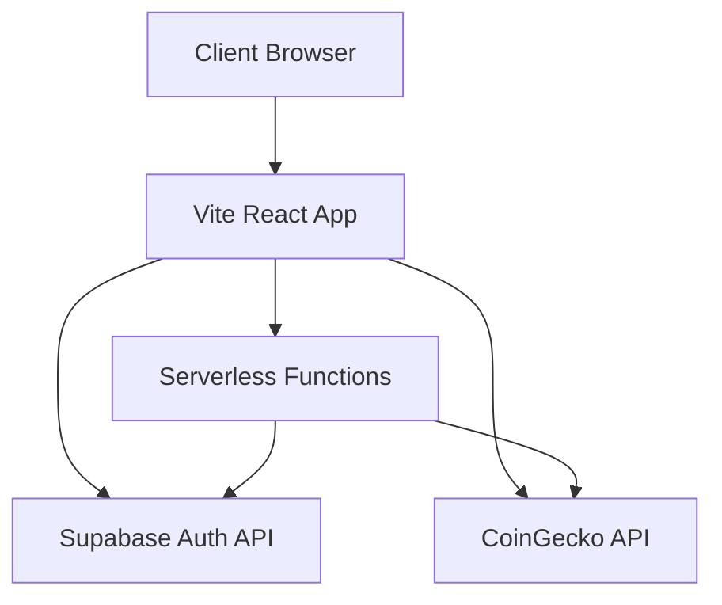

# Neo Coin Brief

[](LICENSE)
[](https://reactjs.org/)
[](https://www.typescriptlang.org/)
[](https://vitejs.dev/)

A modern cryptocurrency newsletter landing page built with React, TypeScript, Vite, and Supabase. This application features real-time cryptocurrency price tracking, newsletter subscription functionality, and a responsive design with dark/light mode support.


## Table of Contents

- [Features](#features)
- [Demo](#demo)
- [Tech Stack](#tech-stack)
- [Architecture](#architecture)
- [Getting Started](#getting-started)
  - [Prerequisites](#prerequisites)
  - [Installation](#installation)
  - [Environment Variables](#environment-variables)
- [Development](#development)
  - [Available Scripts](#available-scripts)
  - [Project Structure](#project-structure)
- [API Endpoints](#api-endpoints)
- [Deployment](#deployment)
- [Contributing](#contributing)
- [License](#license)

## Features

- 📈 Real-time cryptocurrency price ticker with live data from CoinGecko
- 📧 Newsletter subscription with Supabase authentication
- 🌗 Dark/light mode toggle with system preference detection
- 📱 Fully responsive design for all device sizes
- ⚡ Fast performance with Vite and React
- 🎨 Modern UI with glass morphism effects and gradients
- 📚 SEO optimized with proper meta tags
- 🛡️ Form validation and error handling
- 📦 Component-based architecture with shadcn/ui
- 🔄 Smooth animations with Framer Motion
- 📊 Analytics integration with Vercel

## Demo

A live demo of the application is available at: [https://neo-coin-brief.vercel.app](https://neo-coin-brief.vercel.app)

## Tech Stack

| Category | Technology |
|---------|------------|
| **Frontend** | React 18, TypeScript, Tailwind CSS |
| **UI Components** | shadcn/ui, Radix UI |
| **Build Tool** | Vite |
| **Routing** | React Router DOM |
| **State Management** | React Query (TanStack Query) |
| **Animations** | Framer Motion |
| **Backend** | Serverless functions (Node.js) |
| **Database** | Supabase |
| **APIs** | CoinGecko for cryptocurrency prices |
| **Deployment** | Vercel |
| **Analytics** | Vercel Analytics |

## Architecture



### Key Components

1. **Frontend**: React application with TypeScript and Tailwind CSS
2. **UI Layer**: shadcn/ui components with custom styling
3. **State Management**: React Query for server state, React Context for UI state
4. **API Layer**: Serverless functions for backend logic
5. **Data Layer**: Supabase for user authentication and data storage
6. **External APIs**: CoinGecko for cryptocurrency price data

## Getting Started

### Prerequisites

- [Node.js](https://nodejs.org/) (version 18 or higher) or [Bun](https://bun.sh/)
- A [Supabase](https://supabase.io/) account
- A [CoinGecko](https://www.coingecko.com/) API key (optional for price data)

### Installation

1. Clone the repository:

```bash
git clone https://github.com/your-username/neo-coin-brief.git
```

2. Navigate to the project directory:

```bash
cd neo-coin-brief
```

3. Install dependencies:

```bash
npm install
# or
bun install
```

### Environment Variables

Create a `.env.local` file in the root directory with the following variables:

```env
VITE_SUPABASE_URL=your_supabase_url
VITE_SUPABASE_ANON_KEY=your_supabase_anon_key
SUPABASE_SERVICE_ROLE_KEY=your_supabase_service_role_key
```

To get these values:

1. Go to your Supabase project dashboard
2. Navigate to Settings > API
3. Copy the Project URL and Project API keys (anon and service_role)

**Note**: For security, never commit your actual keys to version control.

## Development

### Available Scripts

| Command | Description |
|---------|-------------|
| `npm run dev` | Start development server on port 3000 |
| `npm run build` | Build for production |
| `npm run build:dev` | Build for development |
| `npm run lint` | Run ESLint |
| `npm run preview` | Preview production build locally |
| `npm run dev:vercel` | Start Vercel development server on port 8080 |

### Project Structure

```bash
neo-coin-brief/
├── api/                    # Serverless API functions
├── public/                 # Static assets
├── src/
│   ├── components/         # Reusable UI components
│   │   └── ui/             # shadcn/ui components
│   ├── pages/              # Page components for routing
│   ├── integrations/       # Third-party service integrations
│   │   └── supabase/       # Supabase client and auth utilities
│   ├── hooks/              # Custom React hooks
│   ├── lib/                # Utility functions
│   ├── App.tsx             # Main application component
│   ├── main.tsx            # Application entry point
│   └── index.css           # Global styles and design tokens
├── .env.local              # Environment variables (not committed)
└── package.json            # Project dependencies and scripts
```

## API Endpoints

### `/api/crypto-prices`

Fetches real-time cryptocurrency prices from CoinGecko API with 45-second caching.

**Method**: GET
**Response**:
```json
[
  {
    "symbol": "BTC/USD",
    "price": "43250.21",
    "priceChangePercent": "2.34"
  }
]
```

### `/api/save-email-to-supabase`

Handles newsletter subscription by saving email to Supabase authentication.

**Method**: POST
**Request Body**:
```json
{
  "email": "user@example.com"
}
```

## Deployment

This application is configured for deployment on Vercel:

1. Connect your GitHub repository to Vercel
2. Set environment variables in Vercel project settings:
   - `VITE_SUPABASE_URL`
   - `VITE_SUPABASE_ANON_KEY`
   - `SUPABASE_SERVICE_ROLE_KEY`
3. Deploy!

The `vercel.json` file handles routing with a fallback to `index.html` for client-side routing.

### Environment Configuration

For production deployment, ensure the following environment variables are set in your Vercel project settings:

| Variable | Description |
|----------|-------------|
| `VITE_SUPABASE_URL` | Supabase project URL |
| `VITE_SUPABASE_ANON_KEY` | Supabase anonymous key |
| `SUPABASE_SERVICE_ROLE_KEY` | Supabase service role key |

## Contributing

We welcome contributions to improve Neo Coin Brief! Here's how you can contribute:

1. Fork the repository
2. Create your feature branch (`git checkout -b feature/AmazingFeature`)
3. Commit your changes (`git commit -m 'Add some AmazingFeature'`)
4. Push to the branch (`git push origin feature/AmazingFeature`)
5. Open a pull request

Please ensure your code follows the existing style and includes appropriate tests.

### Development Guidelines

1. Follow the existing code style and conventions
2. Write clear, concise commit messages
3. Add tests for new functionality
4. Ensure all tests pass before submitting a pull request
5. Update documentation as needed

## License

This project is licensed under the MIT License - see the [LICENSE](LICENSE) file for details.

---

Built with ❤️ using React, TypeScript, and Vercel